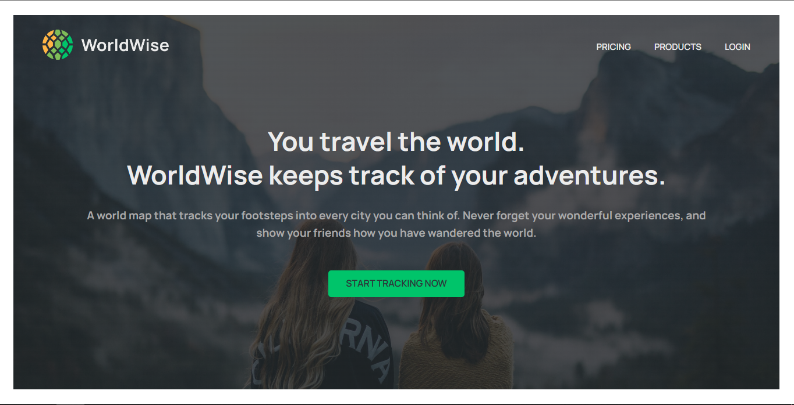
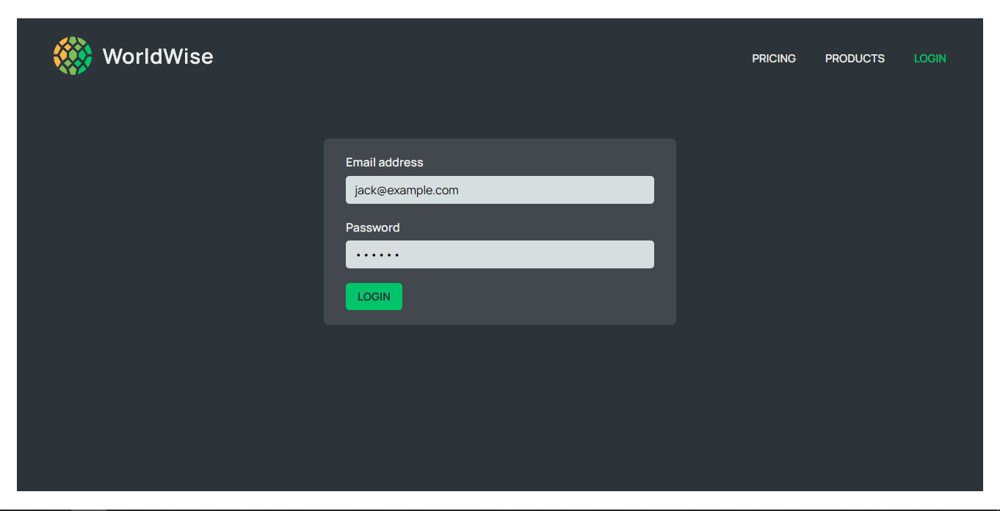
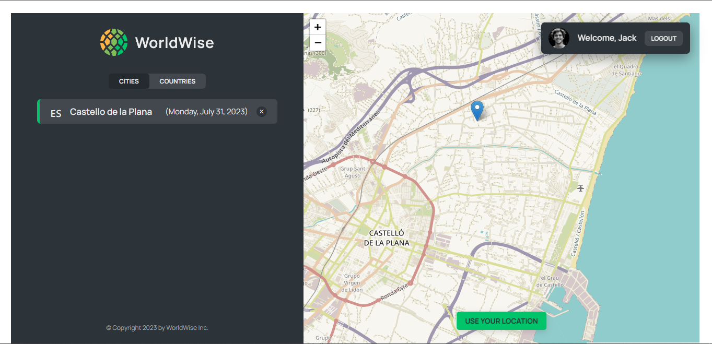
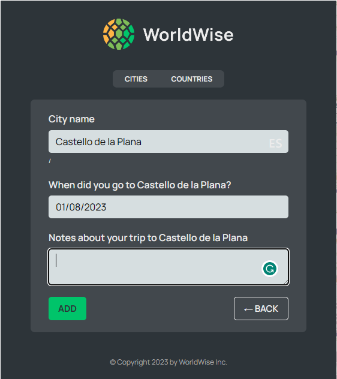
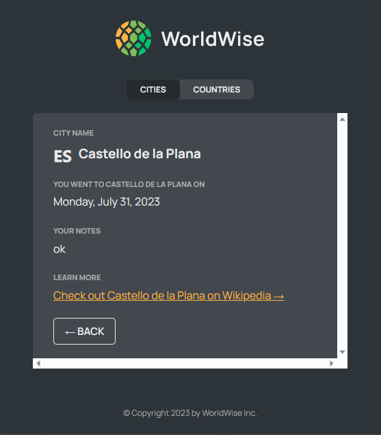

# WorldWise

WorldWise is a travel tracking and adventure registration application. Its main purpose is to allow users to register and keep track of the places they have traveled to, providing them with a visual representation of their adventures on a map.

## Features

- Interactive maps powered by [Leaflet], a JavaScript library for mobile-friendly interactive maps.
- Adventure Registration: Users can fill out a form to register the cities they have visited. The form likely includes fields such as city name, date of visit, and any additional details they wish to provide.
- Map Visualization: The app incorporates a map component that displays markers for each registered city the user has visited. Clicking on a marker provides more information about the city and the user's adventure there.
- Context API for managing global state and theme.
- Custom hooks for encapsulating logic and reusing functionality.
- React Router for navigation and routing.

## Installation

To run this project locally, you need to have [Node.js] and [npm] installed on your machine.

1. Clone this repository or download the zip file.
2. Navigate to the project directory and run `npm install` to install the dependencies.
3. Run `npm start` to start the development server.
4. Open [http://localhost:3000](http://localhost:3000) to view the app in the browser.

## Screenshots

## License

This project is licensed under the MIT License - see the [LICENSE] file for details.

How else can I help?
